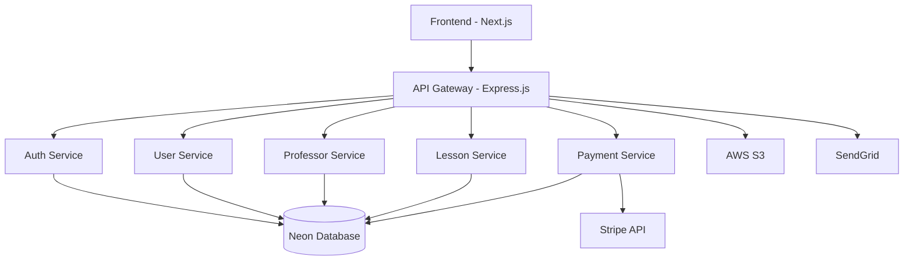

# Design Document

## Overview

**MestresMusic** será desenvolvida com design moderno, elegante e profissional, utilizando uma paleta de cores predominantemente escura (preto/cinza escuro) com acentos em laranja vibrante. O design visa transmitir sofisticação e modernidade, adequado tanto para professores profissionais quanto para alunos de todas as idades.

A arquitetura seguirá o padrão de monolito modular, permitindo escalabilidade futura para microsserviços, com separação clara entre frontend (React/Next.js) e backend (Node.js/TypeScript).

## Architecture

### System Architecture Overview



### Technology Stack

- **Frontend:** React 18 + Next.js 14 + TypeScript
- **Backend:** Node.js + Express.js + TypeScript
- **Database:** Neon Database (PostgreSQL Serverless)
- **Authentication:** JWT + bcrypt
- **Payments:** Stripe
- **File Storage:** AWS S3
- **Email:** SendGrid

## Components and Interfaces

### Frontend Components Architecture

#### Design System - Color Palette
- **Primary Background:** `#0a0a0a` (Deep Black)
- **Secondary Background:** `#1a1a1a` (Dark Gray)
- **Card Background:** `#2a2a2a` (Medium Gray)
- **Primary Accent:** `#ff6b35` (Vibrant Orange)
- **Secondary Accent:** `#ff8c42` (Light Orange)
- **Text Primary:** `#ffffff` (White)
- **Text Secondary:** `#b0b0b0` (Light Gray)
- **Success:** `#10b981` (Green)
- **Error:** `#ef4444` (Red)

#### Core Components

**Layout Components:**
```typescript
// Header with modern dark theme
interface HeaderProps {
  user?: User;
  onLogout: () => void;
}

// Navigation with orange accents
interface NavigationProps {
  currentPath: string;
  userType: 'student' | 'professor' | 'admin';
}

// Card component with dark theme
interface CardProps {
  children: ReactNode;
  variant?: 'default' | 'elevated' | 'outlined';
  className?: string;
}
```

**UI Components:**
```typescript
// Button with orange primary theme
interface ButtonProps {
  variant: 'primary' | 'secondary' | 'outline' | 'ghost';
  size: 'sm' | 'md' | 'lg';
  loading?: boolean;
}

// Input with dark theme styling
interface InputProps {
  label?: string;
  error?: string;
  darkTheme: true;
}

// Modal with dark background
interface ModalProps {
  isOpen: boolean;
  onClose: () => void;
  title: string;
  darkOverlay: true;
}
```

### Backend Service Architecture

#### Auth Service
```typescript
interface AuthService {
  register(userData: RegisterDto): Promise<AuthResponse>;
  login(credentials: LoginDto): Promise<AuthResponse>;
  refreshToken(token: string): Promise<AuthResponse>;
  validateToken(token: string): Promise<User>;
}
```

#### Professor Service
```typescript
interface ProfessorService {
  create(professorData: CreateProfessorDto): Promise<Professor>;
  findAll(filters: SearchFiltersDto): Promise<Professor[]>;
  findById(id: string): Promise<Professor>;
  updateProfile(id: string, data: UpdateProfessorDto): Promise<Professor>;
  updateAvailability(id: string, slots: AvailabilitySlot[]): Promise<void>;
  
  // Portfolio management
  uploadPdfMaterial(professorId: string, file: File, metadata: PdfMaterialDto): Promise<PdfMaterial>;
  updatePdfMaterial(materialId: string, data: UpdatePdfMaterialDto): Promise<PdfMaterial>;
  deletePdfMaterial(materialId: string): Promise<void>;
  
  addYoutubeLink(professorId: string, linkData: YoutubeLinkDto): Promise<YoutubeLink>;
  updateYoutubeLink(linkId: string, data: UpdateYoutubeLinkDto): Promise<YoutubeLink>;
  deleteYoutubeLink(linkId: string): Promise<void>;
  
  addCertification(professorId: string, certData: CertificationDto): Promise<Certification>;
  updateCertification(certId: string, data: UpdateCertificationDto): Promise<Certification>;
  deleteCertification(certId: string): Promise<void>;
  
  addAchievement(professorId: string, achievementData: AchievementDto): Promise<Achievement>;
  updateAchievement(achievementId: string, data: UpdateAchievementDto): Promise<Achievement>;
  deleteAchievement(achievementId: string): Promise<void>;
  
  // Access control for materials
  canAccessPdfMaterial(materialId: string, userId: string): Promise<boolean>;
}
```

#### Lesson Service
```typescript
interface LessonService {
  create(lessonData: CreateLessonDto): Promise<Lesson>;
  findByStudent(studentId: string): Promise<Lesson[]>;
  findByProfessor(professorId: string): Promise<Lesson[]>;
  updateStatus(id: string, status: LessonStatus): Promise<Lesson>;
  checkAvailability(professorId: string, dateTime: Date): Promise<boolean>;
}
```

## Data Models

### User Entity
```typescript
interface User {
  id: string;
  email: string;
  passwordHash: string;
  name: string;
  type: 'STUDENT' | 'PROFESSOR' | 'ADMIN';
  profileImageUrl?: string;
  isActive: boolean;
  createdAt: Date;
  updatedAt: Date;
}
```

### Professor Entity
```typescript
interface Professor {
  id: string;
  userId: string;
  biography: string;
  experience: string;
  methodology: string;
  baseHourlyRate: number;
  onlineAvailable: boolean;
  inPersonLocation?: string;
  approvalStatus: 'PENDING' | 'APPROVED' | 'REJECTED';
  averageRating: number;
  totalReviews: number;
  instruments: ProfessorInstrument[];
  availability: AvailabilitySlot[];
  socialLinks: SocialLinks;
  portfolio: ProfessorPortfolio;
}

interface ProfessorPortfolio {
  id: string;
  professorId: string;
  pdfMaterials: PdfMaterial[];
  youtubeMusicLinks: YoutubeLink[];
  certifications: Certification[];
  achievements: Achievement[];
}

interface PdfMaterial {
  id: string;
  title: string;
  description: string;
  fileUrl: string;
  fileName: string;
  fileSize: number;
  isPublic: boolean; // false = apenas alunos matriculados
  uploadedAt: Date;
  category: 'EXERCISE' | 'THEORY' | 'SHEET_MUSIC' | 'METHOD' | 'OTHER';
}

interface YoutubeLink {
  id: string;
  title: string;
  youtubeUrl: string;
  description: string;
  category: 'PERFORMANCE' | 'TUTORIAL' | 'COMPOSITION' | 'COVER' | 'OTHER';
  addedAt: Date;
}

interface Certification {
  id: string;
  title: string;
  institution: string;
  year: number;
  description?: string;
  certificateUrl?: string;
}

interface Achievement {
  id: string;
  title: string;
  description: string;
  year: number;
  type: 'AWARD' | 'PERFORMANCE' | 'PUBLICATION' | 'OTHER';
}
```

### Lesson Entity
```typescript
interface Lesson {
  id: string;
  studentId: string;
  professorId: string;
  startDateTime: Date;
  endDateTime: Date;
  durationMinutes: number;
  totalPrice: number;
  status: 'PENDING' | 'CONFIRMED' | 'COMPLETED' | 'CANCELLED';
  paymentId?: string;
  createdAt: Date;
}
```

## Error Handling

### Frontend Error Handling
```typescript
// Global error boundary for React components
class ErrorBoundary extends Component {
  // Handle component errors with dark-themed error UI
}

// API error handling with toast notifications
interface ApiError {
  message: string;
  code: string;
  details?: any;
}

// Error toast with dark theme
const showErrorToast = (error: ApiError) => {
  toast.error(error.message, {
    style: {
      background: '#2a2a2a',
      color: '#ffffff',
      border: '1px solid #ff6b35'
    }
  });
};
```

### Backend Error Handling
```typescript
// Global error middleware
interface ErrorResponse {
  success: false;
  message: string;
  code: string;
  timestamp: Date;
  path: string;
}

// Custom error classes
class ValidationError extends Error {
  constructor(message: string, public field: string) {
    super(message);
  }
}

class NotFoundError extends Error {
  constructor(resource: string) {
    super(`${resource} not found`);
  }
}
```

## Testing Strategy

### Frontend Testing
- **Unit Tests:** Jest + React Testing Library
- **Component Tests:** Storybook for UI components
- **E2E Tests:** Playwright for critical user flows
- **Visual Regression:** Chromatic for design consistency

### Backend Testing
- **Unit Tests:** Jest for service logic
- **Integration Tests:** Supertest for API endpoints
- **Database Tests:** Test database with migrations
- **Load Tests:** Artillery for performance testing

### Test Coverage Goals
- Unit Tests: 80% minimum coverage
- Integration Tests: All API endpoints
- E2E Tests: Critical user journeys (signup, booking, payment)

## UI/UX Design Specifications

### Visual Design Principles
1. **Modern Dark Theme:** Sophisticated black/gray palette with orange accents
2. **Minimalist Layout:** Clean, uncluttered interfaces with plenty of white space
3. **Consistent Typography:** Modern sans-serif fonts with clear hierarchy
4. **Intuitive Navigation:** Clear visual cues and logical flow
5. **Responsive Design:** Mobile-first approach with seamless desktop experience

### Key Screen Designs

#### Landing Page
- **Hero Section:** Dark background with orange CTA buttons
- **Features:** Cards with subtle gray backgrounds and orange icons
- **Testimonials:** Dark cards with orange accent borders
- **Footer:** Black background with orange links

#### Dashboard (Student)
- **Sidebar:** Dark gray with orange active states
- **Main Content:** Black background with gray cards
- **Upcoming Lessons:** Orange accent borders for active items
- **Quick Actions:** Orange primary buttons

#### Professor Search
- **Filters:** Dark sidebar with orange checkboxes/sliders
- **Results Grid:** Gray cards with orange hover effects
- **Professor Cards:** Profile images with orange rating stars

#### Professor Profile/Portfolio
- **Header Section:** Dark background with professor photo, name, and key info
- **Navigation Tabs:** Orange active tab indicators for different sections
  - **Sobre:** Biography, experience, methodology
  - **Portfólio:** Certifications, achievements, experience timeline
  - **Materiais:** PDF materials (public preview, full access for enrolled students)
  - **Músicas:** YouTube links organized by category with embedded previews
  - **Avaliações:** Student reviews and ratings
  - **Disponibilidade:** Calendar with available time slots

#### Materials Section (Professor Management)
- **Upload Area:** Dark drag-and-drop zone with orange accent border
- **Material Cards:** Gray cards showing PDF preview, title, and access level
- **Access Control:** Toggle switches (orange when active) for public/private materials
- **Categories:** Filterable tags with orange selected states

#### YouTube Music Section
- **Add Link Form:** Dark input fields with orange focus states
- **Video Grid:** Embedded YouTube previews in dark-themed cards
- **Category Filters:** Orange pill buttons for different music types
- **Video Cards:** Hover effects with orange play button overlay

#### Booking Flow
- **Calendar:** Dark theme with orange selected dates
- **Time Slots:** Gray buttons with orange selected state
- **Payment Form:** Dark inputs with orange focus states
- **Confirmation:** Success state with orange checkmarks

### Responsive Breakpoints
- **Mobile:** 320px - 768px
- **Tablet:** 768px - 1024px
- **Desktop:** 1024px+

### Accessibility Features
- **Color Contrast:** WCAG AA compliance with dark theme
- **Keyboard Navigation:** Full keyboard accessibility
- **Screen Reader:** Proper ARIA labels and semantic HTML
- **Focus Indicators:** Orange focus rings for dark theme

## Performance Considerations

### Frontend Optimization
- **Code Splitting:** Route-based and component-based splitting
- **Image Optimization:** Next.js Image component with WebP
- **Caching:** Service worker for offline functionality
- **Bundle Size:** Tree shaking and dynamic imports

### Backend Optimization
- **Database Indexing:** Optimized queries for search and filtering
- **Caching:** Redis for session and frequently accessed data
- **API Rate Limiting:** Prevent abuse and ensure fair usage
- **Connection Pooling:** Efficient database connections

### Monitoring and Analytics
- **Performance Monitoring:** Real User Monitoring (RUM)
- **Error Tracking:** Sentry for error reporting
- **Analytics:** User behavior tracking with privacy compliance
- **Uptime Monitoring:** Service availability tracking